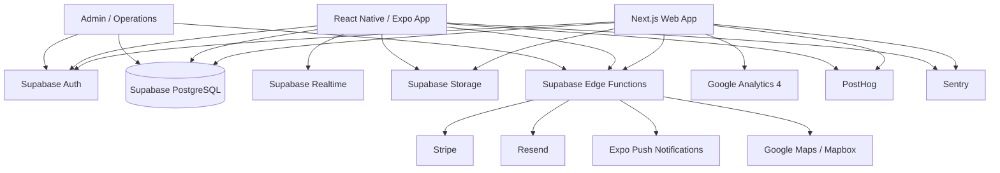

# Guideless Tours — Software Architecture & Product Specification

**Version:** 0.1
**Status:** Greenfield / starting from scratch
**Audience:** Claude Code / engineering team / product / design
**Primary objective:** Build the first production version of Guideless Tours as a scalable, low-operations travel platform where Guideless organizes the trip but intentionally minimizes traditional tour-guide intervention.

> This is the master specification. Topic documents in `docs/` and decision records in `docs/adr/` are derived from it. When they disagree, fix the derived document.

---

## 1. Product definition

### 1.1 Brand concept

Guideless Tours is a "minimal intervention" travel company.

The company handles the hard logistical work:

- Curating destinations and itineraries
- Organizing accommodations
- Organizing trains/transfers/selected transportation
- Booking selected activities and experiences
- Creating small-group departures
- Connecting travelers with their group
- Providing a high-quality digital itinerary
- Providing support when needed
- Creating optional "live moments" during a trip

The company deliberately does **not** behave like a conventional guided tour operator.

The traveler should feel: _"Everything important is organized. I am free to experience the place myself."_

The product should therefore optimize for **confidence + freedom**, not constant instructions.

### 1.2 Example trip — France

1. Traveler books a Guideless France departure.
2. Traveler purchases their own flight to Nice.
3. Guideless provides airport arrival instructions and coordinates a welcome drive/transfer with other travelers.
4. Traveler stays in Nice for several days. The mobile app provides hotel information, itinerary, maps, recommended restaurants and activities, "do this today" suggestions, group chat and support.
5. The group travels to Avignon. Guideless arranges the train, the hotel and a wine experience.
6. Travelers continue independently through the itinerary.
7. The group eventually reaches Paris. The app continues to provide logistics, recommendations, group communication, support and optional moments.

### 1.3 Product philosophy

1. Organized, not escorted
2. Useful, not noisy
3. Social, but optional
4. Human support when it matters
5. The itinerary **is** the product

---

## 2. Product surfaces

### A. Public / customer web application

Next.js · TypeScript · React · Tailwind CSS · shadcn/ui (or similarly restrained component system).

Purpose: marketing, destination discovery, tour discovery, tour detail, departure selection, booking, customer account, pre-trip management, post-trip access.

### B. Mobile application

React Native · Expo · TypeScript.

Purpose: digital trip companion — itinerary, maps, group chat, traveler profiles, live moments, notifications, support, documents, trip logistics, post-trip community.

**The mobile app is the primary trip experience once a customer has booked.**

### C. Admin / operations platform

Lives inside the same Next.js application under `/admin`.

Purpose: create and manage tours, departures, customers, travelers, bookings; assign travelers to groups; manage hotels, transportation, activities, itinerary items; send messages; create live moments; handle support; process refunds/cancellations; view operational status and analytics.

Do **not** build a separate admin frontend in v1 unless operational complexity requires it.

---

## 3. Recommended technology stack

### Frontend web

| Area              | Technology                                      |
| ----------------- | ----------------------------------------------- |
| Framework         | Next.js App Router                              |
| Language          | TypeScript                                      |
| UI                | React                                           |
| Styling           | Tailwind CSS                                    |
| Components        | shadcn/ui                                       |
| Forms             | React Hook Form                                 |
| Validation        | Zod                                             |
| Server state      | Server Components + TanStack Query where needed |
| Maps              | Google Maps or Mapbox                           |
| Analytics         | Google Analytics 4                              |
| Product analytics | PostHog                                         |
| Error tracking    | Sentry                                          |
| Hosting           | Vercel                                          |
| Image storage     | Supabase Storage                                |
| Authentication    | Supabase Auth                                   |

### Backend

Use **Supabase** as the primary backend platform: PostgreSQL, Authentication, Row Level Security, Storage, Realtime, Edge Functions, database triggers, scheduled jobs (pg_cron / Supabase ecosystem).

Recommended architecture: **Next.js + Supabase + Stripe + Resend + Expo.** This is deliberately boring infrastructure. That is a feature.

### Mobile

| Area              | Technology                      |
| ----------------- | ------------------------------- |
| Framework         | React Native                    |
| Platform          | Expo                            |
| Language          | TypeScript                      |
| Navigation        | Expo Router                     |
| Authentication    | Supabase Auth                   |
| Push              | Expo Notifications              |
| Maps              | react-native-maps / Google Maps |
| Chat              | Supabase Realtime               |
| Local persistence | Expo SQLite / AsyncStorage      |
| OTA updates       | Expo EAS Update                 |
| Builds            | Expo EAS                        |

### Payments

Use **Stripe**. Do not store card information in Guideless databases. Stripe handles payment, deposits, remaining balances, refunds, payment methods, receipts, payment status, webhooks. The Guideless database stores Stripe IDs and business state, not card data.

### Email

Use **Resend** initially. Emails: welcome, booking confirmation, payment confirmation, payment reminder, trip reminder, departure information, itinerary changes, support response, group invitation, post-trip message.

### Analytics

GA4 for marketing analytics · Google Tag Manager if marketing integrations grow · PostHog for product analytics · Sentry for errors/performance. Do not use Google Analytics as the operational analytics system.

---

## 4. High-level architecture



---

## 5. Core architectural rule

**Supabase is the system of record. Do not create parallel sources of truth.**

- Booking state belongs in PostgreSQL.
- Payment state belongs in PostgreSQL, synchronized from Stripe webhooks.
- Itinerary state belongs in PostgreSQL.
- Chat messages belong in PostgreSQL.
- Customer identity belongs in Supabase Auth + profile tables.
- Images/documents belong in Supabase Storage with database metadata.

Next.js is the application layer. Supabase is the data/auth/realtime layer. Stripe is the payment processor. External suppliers are represented as integrations or manual operational records.

---

## 6. Repository structure

```
guideless/
├── apps/
│   ├── web/                # Next.js: (marketing)/, tours/, destinations/, checkout/, account/, trips/, support/, admin/
│   └── mobile/             # Expo: app/, components/, lib/, hooks/
├── packages/
│   ├── ui/                 # (create when a second consumer needs shared components)
│   ├── types/
│   ├── validation/
│   ├── config/
│   └── utils/
├── supabase/
│   ├── migrations/
│   ├── seed/
│   ├── functions/
│   └── config.toml
├── docs/
│   ├── architecture.md  database.md  api.md  security.md  product.md  design-system.md  deployment.md
│   └── adr/
├── package.json
├── pnpm-workspace.yaml
└── turbo.json
```

Use **pnpm** and **Turborepo**. Shared packages hold TypeScript types, Zod schemas, design tokens, API models, date/time utilities and booking status enums.

---

## 7. User types

### 7.1 Visitor (unauthenticated)

Can: browse tours and destinations, read marketing content, view itinerary previews, view departure availability, start checkout, contact Guideless, create an account.
Cannot: see private traveler information, group chat, private trip information, customer documents.

### 7.2 Customer / Traveler (authenticated, one or more bookings)

Can: manage profile and traveler information; view bookings, payments, trips, itinerary, travel documents; chat with group; contact support; receive notifications; participate in live moments; view post-trip community content.

### 7.3 Trip / Operations Staff (internal)

Can: manage trips, groups, itinerary, travelers, suppliers; send trip communications; handle support; manage live moments.
Should **not** automatically have full financial/admin access.

### 7.4 Admin (full system access)

Can: manage users, roles, tours, departures, pricing, bookings, payments/refunds, suppliers, CMS, staff permissions; view audit logs; configure system settings.

---

## 8. RBAC

Application roles plus database-enforced access.

```
customer
trip_staff
support
content_editor
finance
admin
super_admin
```

Do not rely solely on frontend role checks. Every sensitive database operation must also be protected with Supabase Row Level Security.

---

## 9. Brand / visual system

The logo establishes the direction: deep navy/black-green, turquoise, aqua, bright cyan, soft warm off-white, white, strong geometric typography.

The product should feel: **modern + adventurous + premium + calm + international.**

It should NOT feel: corporate travel agency, backpacker hostel, generic SaaS, luxury hotel cliché, overly "tech startup".

---

## 10. Color system

Use CSS variables rather than hardcoding colors.

| Token           | Value     | Use                                                                     |
| --------------- | --------- | ----------------------------------------------------------------------- |
| `--color-ink`   | `#0B2025` | Primary text, navigation, buttons, headers, footer, dark backgrounds    |
| `--color-aqua`  | `#60E1BB` | Primary accent, highlights, active states, map routes, positive moments |
| `--color-cyan`  | `#17B1DF` | Links, interactive elements, activity accents, secondary CTA states     |
| `--color-teal`  | `#40B4BD` | Supporting teal — use sparingly                                         |
| `--color-sand`  | `#DAD9D0` | Secondary background, cards, section backgrounds, journal surfaces      |
| `--color-cloud` | `#F5F6F2` | Primary page background                                                 |
| `--color-white` | `#FFFFFF` | Cards and contrast                                                      |

## 11. Color usage rule

Do not make the entire site turquoise. **70% neutral/off-white · 20% deep ink · 10% aqua/cyan accents.** The brand should feel restrained.

- Primary CTA: deep ink background + white text.
- Secondary CTA: aqua/teal outline or subtle filled treatment.
- Avoid excessive gradients. Gradients may be used for photography overlays and occasional hero treatments, not as the default UI language.

## 12. Typography

Primary: **Inter** (UI/body). Headings: **Manrope**. Alternative: Manrope throughout.

Typography should be large, clean, spacious, highly readable.

```
Hero:        64–80px
H1:          48–64px
H2:          36–48px
H3:          24–32px
Body large:  20px
Body:        16–18px
Small:       14px
```

Mobile scales down naturally. Do not use decorative travel fonts.

## 13. Design language

Central metaphor: **the road/path is always there, but nobody is forcing you down it.**

Visual concepts: maps, routes, coordinates, passport/document motifs, curved lines, small location markers, large photography, lots of negative space, timeline-based itineraries.

Avoid: compass clichés, excessive airplane icons, stock photos of tour guides, "adventure" badges everywhere.

---

## 14. Public website pages

### Home — `/`

Sections: Hero ("Travel organized. Explore independently."), How Guideless works, Featured trips, Destinations, What is included, What is not included, Social proof, Sample itinerary, FAQ, CTA.
Primary CTA: **Explore Trips**. Secondary: **How Guideless Works**.

### How It Works — `/how-it-works`

Pick a trip → Book → Fly in → Meet the group → Follow your itinerary → Explore independently → Join optional experiences → Travel onward → Stay connected. The concept must be immediately understandable.

### Tours — `/tours`

Filters: destination, region, duration, month, price, activity level, group size, style.
Cards show: hero image, destination, duration, starting price, group size, activity level, short description.

### Tour detail — `/tours/[slug]`

One of the most important pages. Hero, overview, why this trip, full itinerary, hotels, included experiences, optional experiences, transportation, group size, dates, price, **what you book yourself**, **what Guideless handles**, FAQ, booking CTA. The Guideless-handles vs traveler-handles distinction must be extremely clear.

### Destinations — `/destinations`, `/destinations/[slug]`

SEO-oriented pages.

### Individual departure — `/tours/[tourSlug]/departures/[departureId]`

Date, availability, price, group size, current group size, booking deadline, included items, payment schedule.

---

## 15. Booking flow

Booking must be intentionally simple.

1. **Choose departure** — tour, date, availability, price
2. **Traveler** — name, email, phone, date of birth, nationality, emergency contact. Only collect what is required.
3. **Preferences** — room preference, dietary requirements, accessibility needs, airport transfer preference, optional experiences
4. **Account** — email/password, magic link, Google OAuth
5. **Terms** — terms, cancellation policy, travel responsibility, privacy policy, supplier terms where applicable, waivers where necessary
6. **Payment** — Stripe Checkout or Stripe Elements
7. **Confirmation** — confirmation number, trip, departure, amount paid, remaining balance, next steps, continue to trip dashboard

---

## 16. Booking architecture

Separate these concepts:

- **Tour** — reusable product definition. e.g. _France: Nice → Avignon → Paris_
- **Tour Version** — snapshot of a tour's content/configuration. Future edits must not silently alter already-booked travelers.
- **Departure** — a specific execution. e.g. _France May 14–23, 2027_
- **Booking** — customer's purchase.
- **Trip** — operational instance for the traveler/group. A booking eventually creates a trip membership.

---

## 17. Core database model

```
Identity:        profiles, roles, user_roles, traveler_profiles, emergency_contacts
Product:         destinations, tours, tour_versions, tour_days, tour_itinerary_items,
                 tour_included_items, tour_excluded_items, tour_faqs
Operations:      departures, departure_groups, trip_members, suppliers, supplier_contacts, supplier_services
Travel logistics: accommodations, accommodation_rooms, transport_segments, activities, activity_sessions, transfers
Booking:         bookings, booking_items, booking_travelers, booking_preferences, payments, refunds, coupons
Trip experience: trips, trip_days, trip_itinerary_items, trip_documents, trip_notes,
                 live_moments, live_moment_participants, checkins
Social:          chat_rooms, chat_members, messages, message_reactions, user_blocks, reports
Support:         support_threads, support_messages, support_attachments, support_assignments
Notifications:   notifications, notification_preferences, push_tokens, email_events
Content:         cms_pages, cms_blocks, destination_guides, recommendations, recommendation_categories
System:          audit_logs, feature_flags, system_settings, webhook_events
```

Supabase `auth.users` remains the authentication source.

## 18. Key relationships

```
Tour
 └── Tour Version
      └── Departure
           └── Departure Group
                └── Trip Members
                     └── Trip

Customer
 └── Booking
      └── Booking Travelers
           └── Trip Member

Trip
 ├── Trip Days
 ├── Itinerary Items
 ├── Documents
 ├── Live Moments
 └── Chat Room
```

---

## 19. Itinerary architecture

The itinerary is the heart of the application. Every item has a type:

```
hotel, transfer, train, flight, activity, meal, free_time, recommendation,
meeting_point, check_in, check_out, live_moment, custom
```

Every item supports: title, description, date, start_time, end_time, timezone, location, latitude, longitude, address, instructions, supplier, booking_reference, confirmation_document, status, visibility.

Visibility: `public_preview`, `booked_customer`, `trip_member`, `staff_only`.

## 20. "Free time" is a first-class itinerary concept

Do not build an itinerary where every hour is occupied.

```
09:00 — Breakfast
10:00 — Free exploration
13:00 — Recommended lunch
14:00 — Free exploration
18:00 — Optional group moment
```

The product should deliberately communicate freedom.

## 21. Recommendations engine

A recommendation attaches to: destination, date, neighborhood, category, time of day, traveler preferences where available.

Categories: `food, coffee, bars, culture, shopping, nature, nightlife, local, hidden_gem, rainy_day, romantic, solo, group`.

Manually curated initially. **Do NOT build an AI recommendation engine in v1.** The schema should make one possible later.

---

## 22. Mobile app information architecture

Primary tabs: **Trip · Explore · Group · Support · Profile**.

- **Trip** — main screen: current day, current location, next activity, hotel, transportation, reminders, nearby recommendations.
- **Explore** — destination-specific recommendations.
- **Group** — members, chat, optional activities, announcements.
- **Support** — contact Guideless, emergency information, FAQ, common problems, request help.
- **Profile** — account, traveler details, documents, notifications, preferences, legal.

## 23. Mobile home screen

Answers: _"What do I need to know right now?"_

```
GOOD MORNING

Nice
Tuesday, June 9

Your hotel          Hotel name · Check-out Thursday
NEXT                Free time · Explore Nice
RECOMMENDED         Walk the old town · 12 min away
TONIGHT             Welcome dinner · 7:30 PM · Optional
YOUR GROUP          8 travelers · 3 unread messages
```

Do not make users dig through a calendar to figure out what is happening.

## 24. Live Moments

A signature feature. A Live Moment is a temporary event or interaction: _"We're meeting in the lobby in 20 minutes." "Sunset walk at 7:45." "Your train leaves in 45 minutes." "Welcome to Avignon."_

Fields: title, description, start_at, end_at, location, created_by, trip_id, visibility, status, capacity.
Statuses: `draft, scheduled, live, completed, cancelled`.

## 25. Group chat

Supabase Realtime. Each departure/group gets a private chat room. Rooms: **Trip Group**, **Announcements**, **Optional Activities**. Staff can post announcements.

Required: moderation tools, report user, block user, remove user from group, staff controls, message deletion policy, auditability. Do not expose email/phone numbers automatically.

## 26. Post-trip social experience

Trip states: `upcoming, active, completed, cancelled`. After completion: keep group chat, allow photo sharing, show trip recap, destinations visited, recommendations, invite to future trips. This creates a natural community loop.

## 27. Notifications

- **Operational** — train departure, hotel check-in/out, transfer pickup, activity start, itinerary change.
- **Social** — new group message, mention, new live moment.
- **Marketing** — new tour, new departure, future destination.

Marketing notifications are controlled separately. Operational notifications should generally not be fully disableable while traveling.

## 28. Push notification rules

Avoid spam. Good: _"Your train to Avignon leaves in 45 minutes."_ Bad: _"Don't forget to check out our amazing Avignon experience!"_ During a trip, operational relevance always wins.

## 29. Support system

Built into the app. Customer: start request → select category → message → attach photo → receive response.
Categories: hotel, transportation, activity, booking, payment, lost item, itinerary, emergency, other.
Staff sees: customer, trip, current location, current itinerary item, booking, previous support history.

## 30. Emergency handling

Not a replacement for emergency services. Clear emergency screen:

```
EMERGENCY
If you are in immediate danger: contact local emergency services.
Guideless Support   [Call] [Message]
Trip Emergency Information
```

Country-specific emergency numbers are stored with destinations.

---

## 31. Admin dashboard

Navigation: Dashboard, Tours, Departures, Trips, Customers, Bookings, Payments, Suppliers, Itineraries, Live Moments, Support, Messages, Content, Analytics, Settings, Audit Log.

## 32. Operations dashboard

Focus on upcoming departures and make operational risk visible:

```
UPCOMING DEPARTURES
France · May 14–23 · 12 / 14 travelers · ● 8 days away
Issues
⚠ 1 missing passport information
⚠ 2 hotel confirmations pending
✓ Train bookings complete
✓ Welcome transfer complete
```

## 33. Departure detail screen

Overview, Travelers, Groups, Itinerary, Hotels, Transportation, Activities, Payments, Documents, Communications, Live Moments, Issues, Audit Log.

## 34. Supplier management

Do not assume every supplier has an API. Expect API integrations, email confirmations, manual bookings, PDFs, spreadsheets, phone confirmations. Build a generic supplier model: supplier, service, contact, confirmation_number, cost, currency, status, reservation_date, cancellation_deadline, documents, internal_notes. APIs come later behind adapters.

## 35. External integration architecture

`SupplierAdapter` abstraction with future `HotelAdapter`, `RailAdapter`, `ActivityAdapter`, `TransferAdapter`. Do not couple the database to one vendor. For v1, manual supplier management is acceptable.

---

## 36. Payments architecture

```
Customer → Next.js Checkout → Stripe Checkout → Stripe → Webhook
        → Supabase Edge Function → payments / bookings tables → Customer confirmation
```

**Never mark a booking "paid" based only on the browser returning from Stripe. The Stripe webhook is authoritative.**

## 37. Booking state machine

Booking: `draft, pending_payment, confirmed, cancelled, refunded, completed`.
Payment: `unpaid, deposit_paid, partially_paid, paid, refunded, partially_refunded, failed`.
**Do not mix booking state and payment state.**

## 38. Cancellation

Data-driven policies (`days_before_departure`, `refund_percentage`). Example: 60+ days 100% · 30–59 days 75% · 15–29 days 50% · 0–14 days 0%. Never hardcode in frontend code.

## 39. Currency

Multiple currencies possible. Store monetary values as **integer minor units** (`price_amount = 349500, currency = USD`). Never floating point.

## 40. Dates and time zones

Store timestamps in UTC **and** the IANA time zone of the travel event (`Europe/Paris`). Display in the item's local zone. Never assume the phone's zone is the event zone.

---

## 41. Database security

RLS is mandatory. A customer can read a trip only if `trip_members.user_id = auth.uid()`; can read messages only if a member of the room. A customer cannot read another customer's booking, staff notes or supplier costs, nor modify payments, itinerary, other travelers or admin data.

## 42. Service role key

Never exposed to browser, mobile or client-side JavaScript. Only server-side operations, Edge Functions and secure backend jobs.

## 43. Audit logging

Log: booking_created, booking_cancelled, refund_created, payment_updated, traveler_added, traveler_removed, itinerary_changed, supplier_changed, admin_login, role_changed, support_assignment, message_deleted.
Fields: actor, action, entity_type, entity_id, metadata, timestamp, ip_address where appropriate. Avoid storing unnecessary personal information.

## 44. Authentication

Customer: Google OAuth, email magic link, email/password if desired. Admin: email + MFA + restricted roles, shorter session lifetimes where practical.

## 45. SEO

Every tour has SEO title, meta description, canonical URL, Open Graph image, structured data, destination information, indexable itinerary content. Generate `sitemap.xml` and `robots.txt`. Structured data: `TouristTrip`, `Product`, `Offer`, `BreadcrumbList`, `FAQPage` where valid.

## 46. Analytics event strategy (GA4)

`view_tour, view_departure, start_checkout, add_traveler, begin_payment, purchase, search_tours, filter_tours, view_destination`. `purchase` includes tour_id, departure_id, currency, value. No unnecessary PII.

## 47. Product analytics (PostHog)

`trip_opened, itinerary_item_viewed, recommendation_opened, map_opened, live_moment_joined, chat_opened, message_sent, support_started, document_opened, trip_completed`.

## 48. Performance requirements

Web: excellent Core Web Vitals, server-render public pages, optimize photography, lazy-load below the fold.
Mobile: trip information available quickly, cache current trip, handle poor connectivity (underground, trains, roaming, hotel Wi-Fi). Never assume perfect connectivity.

## 49. Offline strategy

Cache: current trip, next itinerary items, hotel and transportation info, emergency info, key documents, important addresses. Chat may require connectivity. Show _"Last synced 8 minutes ago"_ rather than silently failing.

## 50. Storage architecture

Buckets: `public-assets, tour-images, user-avatars, trip-documents, booking-documents, support-attachments, trip-media`. Private documents use signed URLs. Never expose private buckets publicly.

---

## 51. API architecture

Most customer CRUD: Next.js / Supabase client → PostgreSQL + RLS.
Sensitive workflows: Next.js → Server Action / Route Handler → Edge Function / trusted backend → Supabase. Examples: Stripe operations, refunds, supplier credentials, admin bulk operations, notification fan-out, system jobs.

## 52. Avoid unnecessary REST infrastructure

Start with Server Components, Server Actions, Supabase queries and Edge Functions. Introduce dedicated APIs only when they solve a real problem.

## 53. Mobile API approach

Small service layer under `lib/` (`auth/, trips/, bookings/, chat/, notifications/, support/`). Prefer `tripService.getCurrentTrip()`, `chatService.sendMessage()` over raw queries in components.

## 54. State management

No Redux by default. React state for local UI, query cache for remote data, Supabase Realtime for live updates, Context only for true global concerns (authenticated user, active trip, theme, notification state).

## 55. Admin content management

Tour content should not require a developer: description, hero image, itinerary, hotels, activities, recommendations, FAQs, included/excluded, departure details. Changing a tour must not mutate a booked customer's historical trip — use versioning/snapshots.

## 56. Tour versioning

A customer booked v1. The company later changes hotel/train/itinerary/activity. The customer retains the correct version/snapshot unless an explicit operational change is made.

## 57. Trip snapshot

When a departure becomes active, generate a trip-specific snapshot of operational information. `Tour Template → Tour Version → Departure → Trip Snapshot`.

---

## 58. Customer dashboard — `/account`

Overview, Bookings, Upcoming Trips, Past Trips, Payments, Documents, Profile, Support, Settings. Upcoming trip prominently links to **Open Trip**.

## 59. Web trip dashboard — `/trips/[tripId]`

Mirrors mobile enough that customers are never locked out without their phone: current day, full itinerary, hotels, transportation, documents, group, support, recommendations.

## 60. Customer profile

`first_name, last_name, preferred_name, email, phone, date_of_birth, nationality, profile_photo, preferred_language, home_country` plus `dietary_preferences, room_preferences, accessibility_notes, travel_preferences`. Only collect sensitive data when operationally necessary.

## 61. Traveler vs account owner

One account ≠ one traveler. A customer may book for a spouse or friend. Traveler records are separate from auth users: `User → Booking → Traveler A, Traveler B`.

## 62. Group assignment

A departure can contain multiple groups (Group A: 8 travelers, Group B: 6). Membership must be explicit.

## 63. Privacy

Customers see only what is necessary plus other travelers' chosen public profile. Never auto-expose phone, email, passport, date of birth, payment details. Traveler-controlled visibility where possible.

## 64. Content moderation

Report message, report user, block user, staff moderation, message removal, account suspension, audit trail. Do not launch a social product without basic moderation.

## 65. Email architecture

Event-driven: `Booking confirmed → DB event → Notification service → Template → Resend`. Version-controlled templates: `booking-confirmed, payment-received, payment-reminder, trip-upcoming, trip-started, itinerary-change, support-response, trip-completed`.

## 66. Notification architecture

Centralize: `notificationService.send({ userId, type, title, body, deepLink })`. Channels: push, email, in_app. One event may produce multiple channels.

## 67. Deep links

Notifications open the exact screen: `guideless://trip/123/itinerary/456`. Web has equivalent routes.

---

## 68. Environment configuration

`development / staging / production`. Variables: `NEXT_PUBLIC_SUPABASE_URL, NEXT_PUBLIC_SUPABASE_ANON_KEY, SUPABASE_SERVICE_ROLE_KEY, STRIPE_SECRET_KEY, NEXT_PUBLIC_STRIPE_PUBLISHABLE_KEY, STRIPE_WEBHOOK_SECRET, RESEND_API_KEY, NEXT_PUBLIC_GOOGLE_MAPS_KEY, NEXT_PUBLIC_GA_ID, NEXT_PUBLIC_POSTHOG_KEY, NEXT_PUBLIC_SENTRY_DSN`. Never commit secrets.

## 69. Deployment

Web: Vercel · Backend: Supabase · Mobile: Expo EAS · CI: GitHub Actions.
PR pipeline: lint → typecheck → unit tests → build → preview. Production: main → CI → deploy. Migrations reviewed and applied via Supabase tooling.

## 70. Testing strategy

- **Unit:** pricing, cancellation, booking state transitions, date calculations, time zones, permissions, notification rules.
- **Integration:** booking, Stripe webhook, authentication, trip creation, chat permissions, support.
- **E2E (Playwright):** browse tour → select departure → checkout → login → view trip; admin edits itinerary.
- **Mobile:** Jest, React Native Testing Library, Expo development builds; E2E later.

## 71. Critical test cases

- Booking: cannot book sold-out departure; payment failure does not confirm; duplicate webhook does not duplicate booking; webhook replay is safe.
- Security: Customer A cannot see Customer B's trip; cannot see staff notes; cannot edit pricing; cannot access another group's chat.
- Itinerary: time zones display correctly; changes reflected appropriately; historical trips retain snapshots.
- Chat: non-members cannot read; removed members lose access; staff can moderate.

## 72. Idempotency

All financial/operational webhooks idempotent. `webhook_events (provider, event_id, processed_at, status, payload_hash)`. If `event_id` exists, do nothing.

## 73. Error handling

Human-facing errors: _"We couldn't complete that booking. Your payment was not charged. Please try again."_ Technical details go to Sentry.

## 74. Observability

Sentry for JS errors, API failures, mobile crashes, performance, failed payments, critical workflow failures. Metrics: `booking_success_rate, payment_failure_rate, support_response_time, trip_issue_count, supplier_confirmation_rate, push_delivery_rate`.

## 75. Admin alerts — Issues feed

Payment failed · traveler missing document · supplier confirmation missing · train booking failed · hotel cancellation deadline approaching · departure below minimum · support request unanswered.

## 76. Feature flags

`live_moments, chat, recommendations, post_trip, new_checkout, new_homepage`. A simple database table is sufficient initially.

## 77. Security principles

RLS everywhere · MFA for admins · no service keys client-side · Stripe holds card data · signed URLs for private documents · Zod input validation · rate limiting on sensitive operations · audit logging · secure HTTP headers · CSRF protections · file type/size validation · malware scanning as scale requires.

## 78. File upload rules

Max size, allowed MIME types, randomized storage names, private storage, scanning when appropriate, database metadata. Never trust the extension.

## 79. Rate limiting

Login attempts, password reset, support creation, chat spam, contact forms, booking attempts, coupon validation. Application- or edge-level at early scale.

## 80. Marketing CMS

Database-backed structured content + basic admin CMS for MVP. Sanity / Contentful / Payload / headless WordPress only later if editors require it.

---

## 81. Tour data example

```json
{
  "name": "Southern France",
  "slug": "southern-france",
  "duration_days": 9,
  "destinations": ["Nice", "Avignon", "Paris"],
  "style": "minimal_intervention",
  "group_size": { "min": 6, "max": 14 }
}
```

## 82. Itinerary example

```json
{
  "day": 1,
  "destination": "Nice",
  "items": [
    { "type": "transfer", "title": "Airport Welcome Transfer", "start": "14:00", "required": true },
    { "type": "hotel", "title": "Check in", "start": "15:00" },
    { "type": "free_time", "title": "Explore Nice", "start": "16:00" },
    { "type": "live_moment", "title": "Welcome Drinks", "start": "19:00", "optional": true }
  ]
}
```

## 83. Booking architecture example

`Tour → Departure → Availability → Checkout → Booking → Stripe Payment → Confirmed Booking → Traveler → Trip → Group → Mobile Access`

## 84. Customer lifecycle

`Visitor → Tour discovery → Tour detail → Departure selection → Checkout → Booking → Pre-trip onboarding → Trip → Post-trip → Future trip`. The website optimizes the first half; the mobile app the second.

## 85. Pre-trip onboarding

`Booking confirmed → Complete profile → Upload required information → Download app → Meet your group → Review itinerary → Receive final trip details`. Progressive reveal; do not overwhelm six months before a trip.

## 86. Progressive disclosure

- **90 days before:** trip overview, dates, major destinations.
- **30 days before:** detailed itinerary, hotels, group, transfers.
- **7 days before:** exact pickup instructions, documents, weather-oriented suggestions, final reminders.
- **During trip:** current day, next action, live moments, recommendations, support.

## 87. Weather (later)

`Trip Day → Weather service → Recommendation adjustment`. _"Rain expected this afternoon. Here are three indoor options in Avignon."_ Not core architecture initially.

## 88–89. AI opportunities (later)

Trip assistant, itinerary Q&A, recommendation assistant, support assistant. `Mobile → AI Assistant → Trip Context Retrieval → Structured Trip Data → Recommendation Data → LLM`. The LLM must never invent train times, hotel confirmations, meeting locations, booking or emergency information — use structured tools for authoritative data.

---

## 90. MVP scope

- **Web:** Home, How it works, Tours, Tour detail, Departure selection, Checkout, Stripe, Authentication, Customer account, Trip dashboard, Admin dashboard.
- **Mobile:** Authentication, Trip home, Itinerary, Hotel details, Transportation, Group members, Group chat, Push notifications, Support, Profile.
- **Backend:** Supabase, RLS, Booking, Payments, Trips, Itinerary, Groups, Chat, Notifications, Support.

## 91. Phase 2

Live Moments, recommendation engine, post-trip social, trip photos, better supplier management, coupons, referrals, reviews, advanced operations dashboard.

## 92. Phase 3

Supplier APIs, automated hotel/rail booking, AI trip assistant, dynamic and weather-aware recommendations, preference matching, loyalty, multi-currency expansion, CRM.

## 93. What NOT to build initially

Custom CRM · custom payment processor · custom chat infrastructure · microservices · Kubernetes · custom authentication · AI itinerary generator · automated supplier marketplace · complex recommendation engine · separate backend server fleet · separate admin frontend. **The first version should be intentionally boring.**

## 94. Recommended initial architecture

```
                 ┌───────────────────┐
                 │      Vercel       │
                 │     Next.js       │
                 │ Marketing + Web   │
                 │ Customer + Admin  │
                 └─────────┬─────────┘
                           ▼
                 ┌───────────────────┐
                 │     Supabase      │
                 │ Auth · PostgreSQL │
                 │ RLS · Storage     │
                 │ Realtime · Edge   │
                 └─────┬─────┬───────┘
             ┌─────────┘     └─────────┐
             ▼                         ▼
       ┌───────────┐             ┌───────────┐
       │  Stripe   │             │   Resend  │
       └───────────┘             └───────────┘

                 ┌───────────────────┐
                 │ React Native/Expo │──▶ Supabase
                 └───────────────────┘
```

## 95. Recommended development order

1. **Foundation** — monorepo, Next.js, Expo, Supabase, TypeScript, Tailwind, shared types, auth, CI/CD, environments.
2. **Data model** — migrations for profiles, tours, tour versions, departures, bookings, travelers, trips, itinerary, groups. **Write RLS policies before building UI.**
3. **Public website** — Home, Tours, Tour detail, Destinations, Booking CTA.
4. **Booking** — departure selection, traveler form, checkout, Stripe, confirmation, booking management.
5. **Admin** — tours, departures, travelers, bookings, itinerary, operations.
6. **Mobile** — auth, trip, itinerary, group, chat, support, push.
7. **Polish** — analytics, Sentry, SEO, performance, accessibility, security audit, E2E tests.
8. **Live Moments** — after the basic trip experience is stable.

## 96. Definition of done

TypeScript types · Zod validation · RLS policies · loading/empty/error states · mobile responsiveness · accessibility · analytics events · tests for business logic · audit logging if sensitive · Sentry error handling · documentation.

## 97. Accessibility

WCAG 2.2 AA: keyboard navigation, focus states, semantic HTML, accessible forms, screen-reader labels, contrast, reduced motion, mobile touch targets, strong visual hierarchy (used outdoors, distracted).

## 98. Mobile UX rules

Usable one-handed, in bright sunlight, with poor connectivity, while walking, quickly. No tiny text or controls. Current trip state always obvious.

## 99. Empty states

Every major screen needs one. _No upcoming trips: "No trips booked yet. Find your next adventure. [Explore trips]"_ · _No messages: "Your group hasn't started chatting yet."_ · _No support requests: "Need a hand? We're here."_

## 100. Operational philosophy in the UI

Prefer "Included: Welcome Experience" over "Mandatory Group Activity"; "Your Guide" (digital) over "Tour Guide Instructions". Terminology: Your Trip, Your Route, Your Group, Live Moments, Explore, Recommendations, Included, Optional, Your Next Stop.

## 101. Core brand copy

**Travel organized. Explore independently.** · **Everything planned. Nothing forced.** · _Guideless Tours takes care of the logistics, so you can experience the destination your way._

## 102. North-star metric

**Successful independent trips** = booking completed, traveler accessed itinerary, core logistics delivered, trip completed, low critical support incidents, customer satisfaction.
Supporting: `booking_conversion, checkout_conversion, app_activation, trip_engagement, live_moment_participation, support_rate, trip_completion, repeat_booking, referral_rate, NPS/CSAT`.

## 103. Business model considerations

Package pricing (base + add-ons: wine tour, extra night, private transfer, optional dinner) · deposits + remaining balance · discounts (promo, referral, early booking) · future membership/loyalty. Data model must not prevent these; MVP need not implement them.

## 104. Booking inventory

Explicit availability: `capacity=14, confirmed=11, held=1, available=2`. Database transactions prevent overbooking. Never compute inventory solely in frontend JavaScript.

## 105. Temporary booking holds

`availability → temporary hold → payment → confirmed`. Holds expire (`hold_expires_at`); a scheduled job releases them.

## 106. Database constraints

Unique confirmation numbers, unique Stripe event IDs, valid currency codes, valid status enums, foreign keys, check constraints, unique traveler membership per trip. Business invariants live in the database where possible.

## 107. Transactional booking

```
BEGIN
  check availability · create booking · create travelers · create payment reference · reserve inventory
COMMIT   (ROLLBACK on any failure — no half-created bookings)
```

## 108. Supplier cost privacy

Customers never receive supplier costs. Cost fields visible only to authorized staff/finance roles.

## 109. Internal notes

Private staff notes stored separately or protected with explicit RLS. Never exposed to travelers.

## 110. Data retention

Define before launch for support conversations, documents, payment metadata, audit logs, chat media, account deletion. Do not blindly hard-delete financial records.

## 111. Account deletion

`Delete request → Verify user → Anonymize personal data where allowed → Retain legally required records → Disable account`.

## 112. Logging rules

Never log passwords, access tokens, Stripe secrets, card data, passport numbers, sensitive personal information. Log IDs and diagnostic metadata.

## 113. Environment strategy

Development: local Supabase, test Stripe, test email. Staging: staging Supabase, Stripe test mode. Production: production Supabase, Stripe live. Never use production customer data for development.

---

## 114. Claude Code instructions

1. TypeScript strict mode. No `any` unless explicitly justified.
2. No secrets in client code.
3. Supabase RLS is mandatory.
4. Business logic must not live only in UI components.
5. Validate external/user input with Zod.
6. Use server-side code for privileged operations.
7. Do not create unnecessary abstractions. Prefer small composable modules.
8. Use database migrations for schema changes. Never edit production manually.
9. Add tests for financial and permission logic.
10. Preserve existing architecture unless there is a documented reason to change it.
11. Do not introduce a new dependency if the existing stack solves it cleanly.
12. Do not create a custom backend server unless a concrete requirement demands it.
13. Keep web and mobile business types synchronized through shared packages.
14. Never expose supplier costs or internal notes to customers.
15. Never trust the client to enforce authorization.
16. Stripe webhooks are authoritative for payment confirmation.
17. Treat the itinerary as the core domain model.

## 115. Claude coding workflow

1. Understand existing architecture.
2. Identify: database changes, RLS changes, shared types, backend logic, web UI, mobile UI, analytics, tests.
3. Implement database migration. 4. Implement permissions. 5. Implement backend/service layer. 6. Implement web. 7. Implement mobile. 8. Add tests.
4. Run `lint`, `typecheck`, `test`, `build`.
5. Document architectural changes.

## 116. Architecture decision records

ADR-001 Next.js for web · ADR-002 Supabase as backend platform · ADR-003 React Native/Expo for mobile · ADR-004 Stripe for payments · ADR-005 PostgreSQL as system of record · ADR-006 RLS for authorization · ADR-007 Monorepo architecture · ADR-008 Tour versioning · ADR-009 Trip snapshots · ADR-010 Supabase Realtime for chat.

## 117. Initial database migration order

```
001_extensions      002_profiles        003_roles           004_destinations
005_tours           006_tour_versions   007_tour_itinerary  008_suppliers
009_departures      010_groups          011_travelers       012_bookings
013_payments        014_trips           015_trip_itinerary  016_chat
017_notifications   018_support         019_live_moments    020_documents
021_audit_logs
```

## 118. First screens to build

Web: Home → Tour listing → Tour detail → Departure selector → Checkout → Confirmation → Customer dashboard → Trip dashboard → Admin dashboard.
Mobile: Login → Trip home → Itinerary → Itinerary detail → Group → Chat → Support → Profile.

## 119. MVP user journey

`Visitor → Home → Explore France → France Tour → Choose May departure → Checkout → Stripe → Confirmation → Download App → Login → Trip Home → View itinerary → Meet group → Chat → Travel → Receive live notification → Complete trip → Post-trip group`

If this flow works beautifully, Guideless has a real product.

## 120. Final architecture recommendation

WEB Next.js + TypeScript + Tailwind + shadcn/ui · MOBILE React Native + Expo + TypeScript · BACKEND Supabase · DATABASE PostgreSQL · AUTH Supabase Auth · REALTIME Supabase Realtime · STORAGE Supabase Storage · PAYMENTS Stripe · EMAIL Resend · MAPS Google Maps / Mapbox · ANALYTICS GA4 + PostHog · ERRORS Sentry · HOSTING Vercel + Supabase + Expo EAS · REPO pnpm + Turborepo + GitHub.

Philosophy: modular monolith, not microservices · PostgreSQL as source of truth · RLS as the security boundary · itinerary at the center · mobile answers "what do I need to know right now?" · operations simple enough that a small team can run real trips without engineers.

## 121. Taglines

Primary: **Travel organized. Explore independently.**
Secondary: **Everything planned. Nothing forced.**
Explanation: _Guideless Tours organizes the logistics, connects you with a small group, and gives you the tools to explore on your own. No tour guide. No rigid schedule. Just a better way to travel._

## 122. Immediate next step for engineering

Before feature code: create `docs/architecture.md, product.md, database.md, security.md, api.md, design-system.md, deployment.md, adr/`. Then initialize monorepo, Next.js, Expo, Supabase; create migrations and RLS; shared TypeScript models; authentication; the first Tour → Departure → Booking flow; the first Trip → Itinerary → Group flow; mobile; payments, realtime, push, analytics, support; test the entire lifecycle.

**Do not build the entire platform at once. Build the complete end-to-end customer journey first.**
